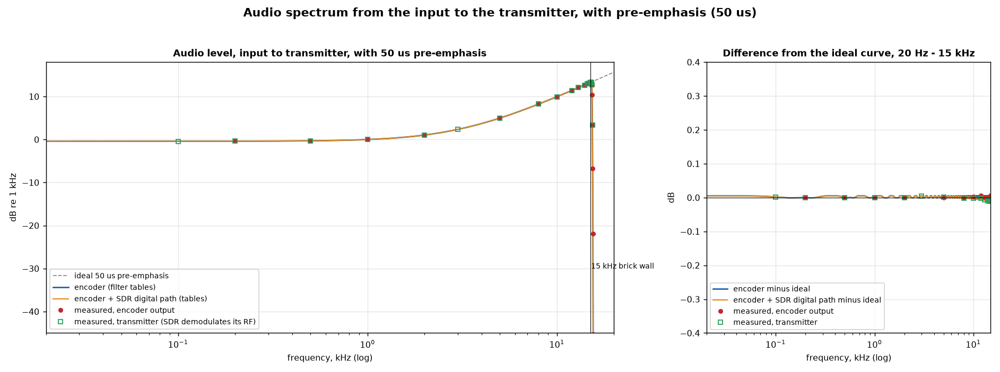
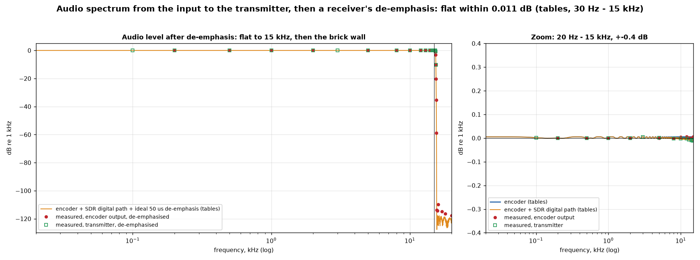
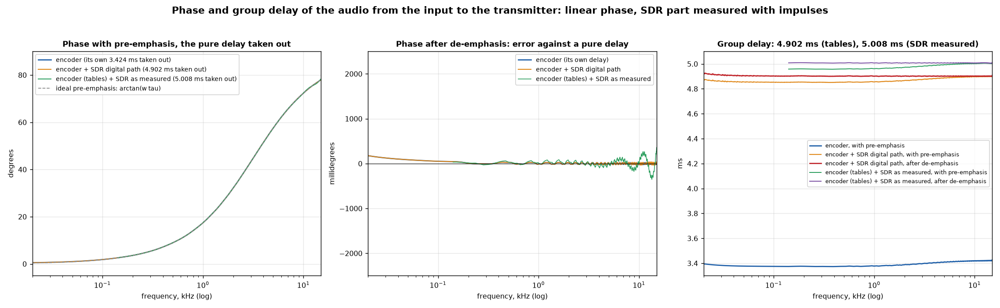
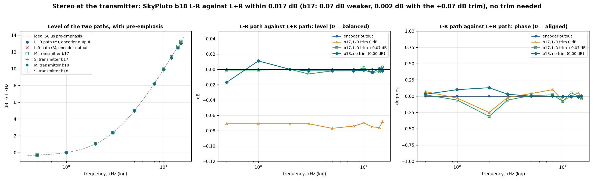
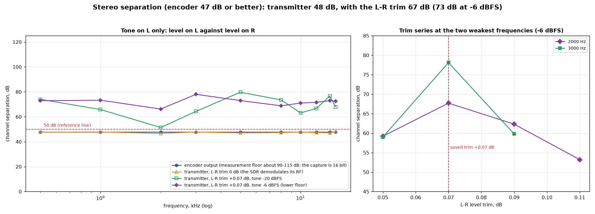
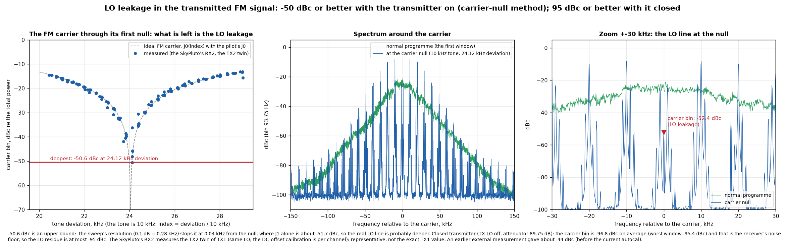
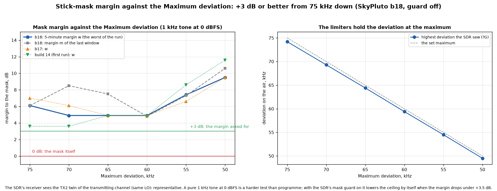

# PlutoSky 7020 Broadcast v1.02 — an FM broadcast exciter on the PlutoSky (Zynq-7020 + AD9361)

SkyPluto WFM turns a **PlutoSky / "7020-SDR"** board (Xilinx Zynq XC7Z020 + Analog Devices AD9361) into a
**wideband-FM broadcast exciter** that tunes anywhere in the AD9361's range, **70 MHz – 6 GHz** (the usual
FM broadcast band, 87.5–108 MHz, is just one use of it). An external stereo/RDS encoder (the
PicoAudio Broadcast encoder, or any encoder that outputs the finished composite/MPX signal
over I2S) delivers the **complete multiplex signal at 192 kHz**. The Pluto does nothing but the last, most critical
step: **FM-modulate it with exact deviation, keep the transmission inside the ITU-R SM.1268-5 spectral mask,
and put it on the air** — with a small FPGA-only signal path (no ARM, no DMA, no jitter).

```
 ┌───────────────────┐  I2S (192 kHz, MPX)   ┌──────────────────────────────────────────────┐
 │ MPX encoder       │ ────────────────────► │ PlutoSky                                     │
 │ (stereo + RDS,    │  BCLK / WS / SDATA    │  I2S RX ► async FIFO ► limiter/fade ►        │
 │  pre-emphasis,    │                       │  interpolator ► FM modulator ► AD9361 ► TX1 ─┼─► [coupler] ──► filter / PA / antenna
 │  e.g. PicoAudio)  │ ◄──────────────────── │                                              │        │ coupled port
 └───────────────────┘  1-wire UART (control)│  RX2 ◄───────────────────────────────────────┼────────┘  (mask monitor, LO/image nulling)
                                             │  RX1 ◄── attenuator ◄── (sample of TX1)      │  power meter (optional)
                                             └──────────────────────────────────────────────┘
```

> **Regulatory note.** Transmitting requires a licence for the frequency you choose. You are responsible for operating
> within the law, within your licence, and inside the spectral mask. Test into a dummy load.

---

## Contents

1. [Features](#features)
2. [Hardware you need](#hardware-you-need)
3. [Connecting it](#connecting-it) — header pinout (I2S, serial, GND), RF ports
4. [First start and how it behaves](#first-start-and-how-it-behaves)
5. [Operating it](#operating-it) — web interface, serial protocol
6. [Mask protection, limiter and levels](#mask-protection-limiter-and-levels)
7. [Measured performance](#measured-performance)
8. [Installing a release on the SD card](#installing-a-release)
9. [Building from source](#building-from-source)
10. [Repository layout and simulation](#repository-layout-and-simulation)
11. [Credits](#credits)

---

## Features

**Signal path (FPGA)**

- **I2S slave receiver with automatic format detection** — 192 kHz (it follows the source within ±1950 ppm around
  192.1875 kHz). Detects *standard I2S*, *left-justified* and *right-justified* (zero padded and sign extended),
  word widths **16 / 20 / 24 / 32 bit**, slot lengths **16 / 24 / 32 / 64 BCLK**. 16-bit data is left-aligned to
  24 bit, so the deviation is identical for every format. A manual override register exists.
- **Adaptive clock-domain crossing**: an asynchronous FIFO whose read rate is steered by a loop, so that the
  encoder's clock and the Pluto's TCXO never over- or underrun the FIFO.
- **Signal conditioner / limiter** (optional, off by default) with a 258-sample (1.34 ms) look-ahead and **true-peak detection**: the limiter looks at the samples *and* at the cubic
  midpoints between them, so the waveform that the interpolator reconstructs stays under the ceiling too. When switched on (`B 1`, ceiling `H`) it is a hard guarantee that the
  deviation never exceeds the ceiling. The **soft fade-in/out** when the I2S stream disappears or returns (no clicks, no splatter) is always on.
- **Polyphase interpolator** from 192 kHz to the 3.072 MSPS baseband rate: a 96-tap x4 FIR (image rejection ≥ 79 dB above 116 kHz) whose passband is pre-compensated for the
  linear stage behind it, so the whole chain is **flat within ±0.002 dB up to 76 kHz** (multiplex, pilot, RDS and RDS2 included). Saturation, never wrap-around.
- **FM modulator**: phase accumulator + a 14-bit, 16384-entry sine/cosine ROM. Deviation = `kdev × 0.75 kHz`
  at 0 dBFS; the fixed scale is `kdev 133` (0 dBFS = 99.75 kHz, 75 kHz = −2.5 dBFS): the deviation follows the input.
- **Channel filter on the FM signal** (after the modulator): −6 dB at ±120 … ±160 kHz or off (`CF`). It cuts the RF skirts that set the
  SM.1268 mask margin, so the deviation no longer has to be limited to keep the mask (multirate: decimate ×4, 63-tap FIR at 768 kS/s, interpolate ×4,
  bit-exact against its model in simulation).
- **Digital LO and image correction**: a DC offset on I/Q against the LO leakage and a Q gain/skew correction against the I/Q image,
  in front of the DAC (set by the automatic nulling, see below). The digital carrier sits at −9 dBFS so that the DAC stays linear at zero-IF.
- **Impulse time-stamping** for end-to-end latency and phase measurements.

**Control software (runs on the Pluto's ARM)**

- **`skypluto-ctl` daemon**: a small C program that owns the radio. Talks to the encoder over a **single-wire
  half-duplex UART**, serves a **web interface on port 80**, and offers a local TCP console.
- **Tune-gated start**: after power-on the transmitter is **closed** (LO off, maximum attenuation). RF only appears
  after the encoder has sent a valid frequency (tune) command.
- **Continuous mask monitoring** (4 spectra per second, 5-minute max-hold) and an optional automatic **mask guard** (off by default, `G 1`) that lowers
  the deviation ceiling when the 5-minute mask margin drops below +3.5 dB, and raises it again when there is room.
- **TX calibration of the AD9361** (LO leakage, image) after every tune and every time the transmitter opens, **with the output muted** until it is done (about 0.3 s; after a boot or a jump of more than 100 MHz also the RX RF DC calibration, about 2 s), and, if switched on with `CT 1`, again when the die temperature has drifted by 8 °C (off by default: during the warm-up after a cold start it would interrupt the programme). The result of every calibration is stored per frequency: after a boot (or when the transmitter is reopened) on the same frequency it is written back instead of calibrating again; a frequency change or `CAL` always calibrates.
- **Automatic LO and image nulling** through the directional coupler right after every calibration (about 4 s, silent carrier): the LO leakage
  and the image are measured on RX2 and nulled with the digital corrections, typically **LO ≤ −70 dBc, image ≤ −75 dBc** on every frequency. The same silent
  carrier gives the **carrier S/N** (residual FM, 50 µs, 30 Hz–15 kHz): ≥ 95 dB, the limit of the coupler path.
- **AD9361 TX analog bandwidth** set to 1.6 MHz (`TB`, the driver's default is 18 MHz): DAC noise and images far from the carrier are filtered.
- **RDS decoder of the own transmission** (`?RD`, web overview): PI, PTY, PS, RadioText and clock time, decoded from the coupler path.
- **Power meter** on RX1, used as a pure measurement bridge: you enter the attenuator value, the web interface and
  the serial protocol report dBm and watts.
- **Watchdog / supervisor**: a crashed daemon is restarted automatically, and an open transmitter stays open.
- **Boot status** is sent to the encoder, which shows it on its splash screen.
- **Measurement-path detection**: a warning when RX2 gets no signal from the coupler.
- Measurement tools: tone meter, end-to-end impulse response, LO leakage, demodulated-MPX capture.

---

## Hardware you need

- A **PlutoSky / "7020-SDR"** board (Zynq XC7Z020 + AD9361, 2 × TX, 2 × RX SMA). Check with `iio_attr -S`: it must
  report `FISH Ball PlutoSDR Rev.A (Z7020-AD9361)`. An original ADALM-PLUTO uses different pins and will **not** work.
- A micro-SD card (FAT32) for the boot files.
- An **MPX source** with an I2S output (3.3 V logic, 192 kHz) — e.g. the PicoAudio Broadcast encoder.
- RF: a **directional coupler** directly on TX1 with its coupled port to RX2 (see below), a dummy load / attenuator for testing,
  a band-pass/low-pass filter and amplifier of your own for real operation. An optional SMA attenuator for the RX1 power meter.
- Ethernet (for the web interface) and a USB cable (power, optional serial/ethernet-over-USB for engineering).

---

## Connecting it

### The 20-pin header (JP5)

The board's expansion header JP5 carries the I2S input and the control UART (all **3.3 V** logic; the Pluto is the I2S slave).
**The header is not in the board's schematic; the pin numbers were measured on the board and cross-checked against the FPGA balls in the
schematic. Verify the pin numbering and the GND pins with a multimeter before connecting anything.**

| JP5 pin | Signal | Encoder side (PicoAudio) | Direction |
|--------:|--------|--------------------------|-----------|
| **7**  | I2S SDATA (data) | GP22 | encoder → Pluto |
| **9**  | Control UART, single wire, half duplex (4.7 kΩ pull-up to 3.3 V) — **optional** | GP26 (**optional**) | encoder ↔ Pluto |
| **11** | I2S LRCLK / WS | GP7 | encoder → Pluto |
| **13** | I2S BCLK (the receiver is clocked by this pin) | GP6 | encoder → Pluto |
| **2** or **20** | GND | GND | common ground |

Notes:

- The I2S pins are in FPGA bank 13 (3.3 V), so a 3.3 V encoder connects directly, no level shifter.
- Keep the I2S wires short (a few cm to ~20 cm) and run the GND next to them.
- The control line (pin 9) is optional: without it the Pluto works stand-alone and is operated from its web interface (the carrier then has to be switched on there after every power-up). It idles high through the external 4.7 kΩ pull-up to 3.3 V, 115200 baud 8N1. Both ends transmit only in their turn (the encoder is the master).

### RF connections

| Port | Connection |
|------|------------|
| **TX1** | **The transmitter output** → directional coupler (through path) → filter → amplifier → antenna (dummy load while testing). Output level is set from −84.75 dBm up to a **−5 dBm maximum**. |
| **Coupler → RX2** | A **directional coupler on the TX1 output**, its **coupled port to RX2** (an SMA coupler of 10–30 dB; terminate an unused port with 50 Ω). This is the measurement path: RX2 monitors the spectrum against the mask, and after every calibration the LO leakage and the image are nulled from it. Keep the level at RX2 below ≈ −10 dBm (overload; damage above **+2.5 dBm**): with the Pluto's own −5 dBm maximum any coupler of ≥ 10 dB is safe. **Never connect TX1 directly to RX2**, and put the coupler *before* an external amplifier. If RX2 gets no signal the web interface shows a red warning and the mask guard is blind. |
| **TX2** | Not used: it is kept muted. (Older setups measured a copy of the modulation on TX2 with a cable TX2 → RX2: `twin=1` in `skypluto-mask.conf`.) |
| **RX1** | Optional **power meter**. Feed a sample of the TX1 output through an attenuator of your choice (e.g. a directional coupler plus attenuator) and enter its total attenuation in the web interface (Control → power meter, serial `Q`) and calibrate against a known level (`QK`). Make sure the level at RX1 stays within the AD9361's input range (the same limits as for RX2 apply). The measuring range is about −50 … −10 dBm at the TX1 output with a 20 dB attenuator (±0.1 dB between −40 and −10 dBm, measured with a spectrum analyser); below that the board's own crosstalk/noise floor (about −71.5 dBm at RX1) dominates. Choose the attenuator to suit your power. The meter is off by default (`QM`). |
| Ethernet | web interface (DHCP, port 80) |
| USB | power; engineering access (the board also appears as a USB network adapter) |

---

## First start and how it behaves

1. Power on. After ~20 s Linux is up. The daemon starts automatically, **the transmitter stays closed** (no RF),
   and the encoder shows the boot progress on its splash screen.
2. When the encoder has sent a **tune command** (`F`) and **on** (`E 1`), the daemon opens the transmitter: LO on,
   output level as set (`P`).
3. If the encoder is not connected, switch the carrier on from the **web interface** (Control → RF on). The
   web settings are volatile; with an encoder connected, the encoder's stored settings win after every re-sync.
4. A restart of just the daemon (an update, a crash) leaves the RF **on**; a power cycle always starts closed.
5. The Pluto's clock has no battery: after a reboot it reads 1970. This does not affect operation.
6. The **green LED** shows the transmitter state: **off** = closed (no RF), **blinking** (2 Hz) = tuning, calibrating or nulling (the output is muted or the carrier is silent), **on** = really on the air.
   After every frequency change this takes about 4.5 s: ~0.3 s AD9361 calibration, then ~4.2 s LO/image nulling through the coupler (the first calibration after a boot, or after a jump of more than 100 MHz, also runs the RX RF DC calibration: ~1.7 s more). The encoder sees `cal=run` in `?E` meanwhile (the PicoAudio blinks its display).
7. A new Pluto needs no configuration for this: without configuration files the mask monitor measures through the coupler on RX2 and the nulling runs after every calibration.

---

## Operating it

### Web interface — `http://<pluto-ip>/`

The Pluto's own web server is replaced by this one (port 80). Light/dark mode, works on a phone.

| Tab | What |
|-----|------|
| **Overview** | carrier frequency/level, deviation meter (20 ms windows, peak hold, ceiling), **SM.1268-5 mask plot** with the 5-minute margin, limiter and mask-guard status, I2S format chip (e.g. `24/32 i2s`), FIFO/I2S dropouts, encoder link status, power meter, RDS of the own transmission (PI, PS, RadioText) |
| **Control** | RF on/off, carrier frequency, output level, deviation scale (`kdev`), limiter on/off, ceiling (max deviation), mask guard on/off, mask reset, channel filter, TX analog bandwidth, LO/image nulling with the carrier S/N, power-meter settings (attenuator value, calibration) |
| **Measure** | tone meter (frequency + deviation of the strongest audio tone), end-to-end impulse response with plot and CSV download |
| **Console** | raw serial-protocol commands with history |

The web interface has no login and stores nothing: **changes made on the web page are not saved**, and an encoder
that is connected re-sends its own configuration at every re-sync (so its stored values win).

### Serial protocol (encoder → Pluto)

The complete reference (all commands, queries, error codes, web API and configuration files) is in [`docs/serial-protocol.md`](docs/serial-protocol.md).

**Physical layer:** one wire, half duplex, 3.3 V, idle high (external 4.7 kΩ pull-up), **115200 baud 8N1**, JP5 pin 9. The encoder is the master:
it sends one line and waits at most 300 ms for the answer. The Pluto does not hear its own answer; the encoder hears its own bytes (echo) and has to discard them.

**Framing:** `<command> [argument]<LF>` (LF only, no CR). The answer is one line: `OK`, `ERR <reason>` (`parse`, `range`, `nolim`, `nosig`, `unstable`) or `key=value …`.
`E`, `F` and `P` are answered `OK` first and executed afterwards (the AD9361 tune takes 130–280 ms); whether the effect is there shows in `?S`.

**Boot status (Pluto → encoder, unsolicited):** while starting, the Pluto sends `#B <percent> <text>` lines (`#B 10 Linux gestart` … `#B 100 Gereed`)
for the encoder's splash screen. The encoder stays silent until `#B 100`. `?B` returns the last boot step at any time.

**Behaviour after power-on:** TX-LO off and maximum attenuation — **no RF until the encoder sends a valid `F` (tune)**.

| Command | Meaning |
|---------|---------|
| `E 0` / `E 1` | transmitter off (maximum attenuation **and** TX-LO off) / on |
| `F <Hz>` | tune (70 MHz … 6 GHz), e.g. `F 108000000`; opens the transmitter after boot |
| `P <dBm>` | TX1 output level, −84.75 … −5.0 (`ERR range` outside) |
| `K <n>` | deviation scale: 0 dBFS = 0.75 kHz × n, 10 … 250 (default and PicoAudio: 133 = 99.75 kHz) |
| `CF 0/120/125/130/135/140/150/160` | channel filter on the FM signal: off / −6 dB at that many kHz from the carrier (stored) |
| `B 0/1` | FPGA limiter off (default) / on |
| `H <kHz>` | deviation ceiling (maximum) of the limiter, 20 … 150 (only with `B 1`) |
| `G 0/1` | mask guard off/on |
| `X` | reset the mask monitor |
| `NULL`, `NULLAUTO 0/1`, `NULLRX 1/2` | LO/image nulling through the coupler now / automatically after every calibration (default on) / receiver (2 = coupler into RX2, default) |
| `OFS <kHz>`, `DC <i> <q>`, `IQ <gain> <skew>`, `LVL <dB>` | manual TX nulling: low-IF offset for measuring (0 = zero-IF), digital DC offset against the LO leakage, digital I/Q gain/phase correction against the image, digital carrier level (default −9 dBFS) (stored in the Pluto; also in the web interface, Control - TX calibration) |
| `J <s>`, `Y <s>`, `Z <s>` | impulse response / carrier-bin / MPX capture measurements |
| `Q <dB>`, `QK <dBm>`, `QM 0/1`, `QG <dB\|A>` | power meter: attenuator value in dB (0…120), calibrate against a known power in dBm (settled signal present), meter off/on, hold the RX1 gain manually / back to automatic |

| Query | Answer |
|-------|--------|
| `?V` | `magic=57464D32 fw=PlutoSky_7020_Broadcast-1.02 proto=2 ver=1.02 bit=B1D0001D` (software version and bitstream id) |
| `?S` | `en=1 f=107999998 p=-29.00 att=34.00 tx=on up=312 kdev=100` — state, frequency, level, attenuation, uptime |
| `?P` | `set=-29.00 out=-29.00 att=34.00 trim=0.00 alc=hold` — set point and the automatic level control |
| `?T` | `temp=39.5` — board temperature (°C) |
| `?E` | `unf= ovf= lim= limn= uf= pk= bg=on ceil=75.0 cmax=75.0 gd=on i2s=24/32 al=i2s` — FIFO under/overflow, limiter gain reduction, input peak (%), limiter state and ceiling, guard state, detected I2S format |
| `?M` | `m=+11.5 w=+4.5 sh=-46.1 fl=-71.4 dev=51 n=170 …` — mask margin now / 5-minute worst case (dB), shoulder, floor |
| `?D`, `?G` | measured peak deviation (0.25 s windows) / swing meter (20 ms windows) |
| `?L` | spectrum around the carrier (mask monitor) |
| `?A` | strongest audio tone: frequency and deviation |
| `?R` | measurement path (coupler → RX2): `r=ok` / `r=missing` / `r=na` |
| `?IQ`, `?NL` | the digital corrections and level / the result of the last nulling (LO and image before/after in dBc, carrier S/N) |
| `?CF`, `?RD` | channel filter / RDS of the own transmission (`rd=ok pi= pty= ps="…" rt="…"`) |
| `TB <kHz>`, `?TB` | analog TX bandwidth of the AD9361 (default 1600 kHz; the driver's 18 MHz passes DAC noise far from the carrier); a change recalibrates |
| `?O` | power meter: `o=<dBm at TX1> w=<watt> in=<dBm at RX1> att= cal= g= st=ok\|low\|high\|nosig\|off` |
| `?B` | last boot step |

`gd=` is `off` (also while the limiter is off: the guard then has no effect), `init` (waiting for enough mask data, about one minute), `on`, or `act` (the guard has lowered the ceiling).

From a shell on the Pluto (`ssh root@<ip>`, default password `analog`):
`/mnt/jffs2/skypluto-ctl -c "?E"` runs the same protocol through a local TCP console.

---

## Mask protection, limiter and levels

Since the **channel filter** (`CF`) the mask is kept by band-limiting the FM signal itself, not by limiting the deviation. The default is
therefore: limiter **off** (`B 0`), fixed scale `K 133` (0 dBFS = 99.75 kHz), and the deviation follows the input — the encoder's processing
decides how loud it is. Measured on programme with `CF 120`: peaks up to 93 kHz and still **+4.3 dB** 5-minute mask margin.

| `CF` | mask margin gained (simulated) | stereo separation at 10 kHz (measured) |
|---|---|---|
| off | — | 69 … 71 dB |
| 160 / 150 | +0.2 / +0.5 dB | 65 dB |
| 140 | +1.3 dB | 63 dB |
| 130 / 125 | +4.1 / +6.6 dB | — |
| 120 | +9.9 dB | 53 dB |

Whoever still wants a hard deviation limit switches the limiter on: `B 1` with a ceiling `H` (on the PicoAudio: *Max deviation* = a value
with the SDR limiter on; *Max deviation* = Off sends `B 0`). The scale stays `K 133`, so pilot and RDS keep their level whatever the setting.
The limit is then enforced **in the FPGA** (a 258-sample look-ahead true-peak limiter), so the transmitted deviation can
never exceed the ceiling. On top of that, the optional **mask guard** (off by default; switch it on with `G 1` or in the encoder menu) watches the spectrum (TX1 through the coupler → RX2) and
adjusts the ceiling:

- the chosen maximum (`H`) is the *upper limit*;
- if the 5-minute mask margin drops below **+3.5 dB**, the ceiling is lowered so that the expected margin becomes +4.5 dB
  (about 0.9 dB of margin per dB of peak reduction, at most 25 % per step, never below 35 kHz);
- if the margin is above +6.5 dB over 30 s, the ceiling goes back up as far as the margin allows (at most 25 % per step), so it is back at the maximum within a few minutes after a loud passage;
- ceiling changes are ramped (0.5 kHz per 100 ms) so that a change does not splatter;
- right after a start, a tune or a mask reset the guard reports **`init`** and takes no decision until the mask
  window holds enough data (~1 minute);
- `G 0` turns the guard off: the ceiling is then exactly `H`.

The state is visible as `gd=off|init|on|act` in `?E` and in the web interface (`act` = the ceiling has been lowered).

The spectral mask margin grows with RF output power (roughly 1 dB per dB), so the **output level** is part of
the mask result: measure with your own amplifier chain and filter, and choose `P`/`H` accordingly.

---

## Measured performance

All measurements were made on the complete chain (encoder → Pluto → RF → the Pluto's own receiver), with the
tools in `scripts/` and `src/skypluto-mask.c`. The figures come from the encoder repository's test suite.

| | |
|---|---|
| Audio response with 50 µs pre-emphasis / de-emphasis | flat within **0.016 dB**, 200 Hz – 15 kHz (transmitter) |
| Total delay, encoder + Pluto | 3.424 ms + about 1.59 ms = **about 5.02 ms**, linear phase (the Pluto part was measured as 1.584 ms; the true-peak look-ahead adds 2 samples = 10 µs) |
| Stereo L−R path | S = M within **±0.004 dB** above 2 kHz (±0.017 dB at 0.5 … 1 kHz), phase ≤ 0.13°, separation 59 … 81 dB (**median 74.5 dB**), **no L−R trim needed** (the interpolator is flat to ±0.002 dB up to 76 kHz) |
| LO leakage and image, transmitter on, after the automatic nulling | LO **−69 … −73 dBc**, image **−75 … −81 dBc** (107.9, 435, 1296 and 2320 MHz; measured through the coupler, the image figures are at the floor of the measurement). With only the AD9361's own calibration the LO is at −51 … −64 dBc and the image at −50 … −68 dBc. Closed ≤ −95 dBc |
| Mask margin (1 kHz tone at 0 dBFS, limiter on, guard off, no channel filter) | ≥ **+4.9 dB** at every maximum deviation from 75 down to 50 kHz (5-minute margin, +6.1 dB at 75 kHz, +9.5 dB at 50 kHz) |
| Mask margin (programme, channel filter ±120, limiter off, peaks up to 93 kHz) | **+4.3 dB** (5-minute worst case) |
| Pilot and RDS (fixed scale `K 133`) | pilot 6.74 kHz (9.0 %), RDS 3.0 kHz peak, identical with the limiter on or off |
| Carrier S/N (residual FM of the silent carrier, 50 µs, 30 Hz–15 kHz, 75 kHz reference) | ≥ **95 dB** (the limit of the coupler path; 0.9 Hz rms) |

| | |
|:--:|:--:|
|  |  |
| **Fig. 1** Audio level with the 50 µs pre-emphasis | **Fig. 2** Audio level after an exact de-emphasis |
|  |  |
| **Fig. 3** Phase and group delay (encoder + Pluto, measured with impulses) | **Fig. 4** L+R and L−R path level and phase |
|  |  |
| **Fig. 5** Stereo separation (tone on L only), this release without any trim against the earlier build | **Fig. 6** LO leakage, carrier-null method (an earlier build, before the automatic nulling) |



**Fig. 7** SM.1268-5 mask margin against the maximum deviation (1 kHz tone at 0 dBFS, limiter on, mask guard off; the bold line is this release, the others are earlier builds).

---

## Installing a release

A release is **one folder for the SD card** (`sdcard`) and, optionally, a folder for updating the control software over the network (`pluto`).

| File (folder `sdcard`) | What |
|------|------|
| `BOOT.bin` | FSBL + **FPGA bitstream (the exciter)** + U-Boot |
| `uImage`, `devicetree.dtb`, `uEnv.txt` | Linux kernel, device tree, U-Boot environment |
| `uramdisk.image.gz` | root file system, **including the control software** (daemon with the web interface, mask tool, start-up scripts) |

**Copying these five files to the SD card is the complete installation.** At boot the root file system installs the bundled control software into the Pluto's
persistent flash (`/mnt/jffs2`) when it is missing or a different version, so a new release is installed by replacing the files on the SD card — nothing else is needed. The settings
kept in `/mnt/jffs2` (`skypluto-*.conf`) are not touched.

### 0. Check the BOOT switch (once)

The board has a two-position **`BOOT`** DIP switch (next to the `RST` button, between the `USB2.0` and `DEBUG` ports) that selects where it boots from. It is sampled at
power-on, so change it only with the power off:

| Mode | SW1 | SW2 |
|------|-----|-----|
| **SD card (needed for this firmware)** | `0` (GND) | `0` (GND) |
| QSPI flash (the board's own firmware) | `1` | `0` |
| JTAG | `1` | `1` |

In QSPI mode the board **ignores the SD card completely** and starts the firmware that is in its flash, which looks exactly like "the new files have no effect".

### 1. Copy the boot files to the SD card

The Pluto boots from the **FAT32 partition** of the micro-SD card (the first partition).

**From Windows / macOS / Linux with a card reader**

1. Insert the card in your computer. It shows up as a small FAT32 drive (the card of a working PlutoSky already has
   `BOOT.bin`, `uImage`, `devicetree.dtb`, `uramdisk.image.gz`, `uEnv.txt`).
2. **Keep a backup copy** of the card's current `BOOT.bin` (rename it `BOOT.bin.good` on the card, or copy it to your
   computer). This is your way back if something goes wrong.
3. Copy the release's `BOOT.bin` onto the card, replacing the old one. If the release also contains `uImage`,
   `devicetree.dtb`, `uramdisk.image.gz` and `uEnv.txt`, copy and replace those too. They must all come from the same release.
4. Eject the card properly (safely remove), put it in the Pluto and power it on.

**Linux command line**

```bash
sudo mkdir -p /mnt/sd && sudo mount /dev/sdX1 /mnt/sd        # X = your SD card; check with lsblk!
sudo cp /mnt/sd/BOOT.bin /mnt/sd/BOOT.bin.good               # backup of the old file
sudo cp BOOT.bin uImage devicetree.dtb uramdisk.image.gz uEnv.txt /mnt/sd/   # whichever files the release contains
sync && sudo umount /mnt/sd
```

**Without removing the card** (the Pluto is up and reachable on the network):

```bash
ssh root@<pluto-ip> 'mount -t vfat /dev/mmcblk0p1 /mnt/sd 2>/dev/null; cp /mnt/sd/BOOT.bin /mnt/sd/BOOT.bin.good'
ssh root@<pluto-ip> 'cat > /mnt/sd/BOOT.bin; sync; md5sum /mnt/sd/BOOT.bin' < BOOT.bin
ssh root@<pluto-ip> 'umount /mnt/sd; reboot'
```

Compare the printed md5 with `md5sum BOOT.bin` on your computer before rebooting.

### 2. Optional: update the control software over the network

The control software is already on the SD card (inside `uramdisk.image.gz`) and is installed automatically at boot. The folder `pluto` of a release is only for updating the
software of a running Pluto **without** replacing the SD-card files (for example a new daemon between two full releases). It holds `skypluto-ctl`, `skypluto-mask`, the scripts and the installers.

**Windows** (Windows 10/11 has the needed `ssh` and `tar` built in): double-click **`install_on_pluto.bat`** in that folder, enter the Pluto's IP address and, when asked, the
password (`analog`). Or from a command prompt in the folder: `install_on_pluto.bat <ip-address>`.

**Linux / macOS / WSL** (needs `ssh` and `sshpass`): in that folder run

```bash
chmod +x install_on_pluto.sh
./install_on_pluto.sh <ip-address> .
```

Both copy the files to `/mnt/jffs2`, stop the board's own web server and restart the daemon. Note: the next boot with an SD card that carries a *different* bundled version installs that version again, so
update the SD card as well when you keep a Pluto for a long time.

### 3. Check

```bash
ssh root@<pluto-ip> '/mnt/jffs2/skypluto-ctl -c "?E"'     # ... i2s=24/32 al=i2s  (once the encoder sends I2S)
```

Open `http://<pluto-ip>/`. Power-cycle the Pluto once and check that the web interface comes back and the carrier
stays closed until the encoder tunes.

**Nothing changes after copying the files?**

- The `BOOT` switch is in QSPI mode (see step 0): set it to SD (`0 0`) and power-cycle.
- The files must be in the **root** of the card's first FAT32 partition (not in a sub-folder), all from the same release. After copying, eject the card properly.
- The `DONE` LED lights when the FPGA bitstream (`BOOT.bin`) has been loaded. Check the running build with `ssh root@<ip> devmem 0x7C440014` (this firmware answers `0x57464D32`) and
  `ssh root@<ip> /mnt/jffs2/skypluto-ctl -c "?V"`.
- Seeing the board's original web page instead of this web interface means the control software was not installed at boot: check that `uramdisk.image.gz` on the card is the one of this release
  (`/usr/share/skypluto/VERSION` on the Pluto shows what it carries), or run the installer of step 2.

**Going back:** put `BOOT.bin.good` back as `BOOT.bin`.

---

## Building from source

The build uses the open
[fishball7020 FPGA devkit](https://github.com/matsvandamme/fishball7020-fpga-devkit) (a rebuildable reconstruction of
the PlutoSky firmware: Vivado 2022.2, Ubuntu 22.04, container build). This repository is an **overlay** on top of it
(devkit commit `edbde76`). Windows users: use WSL2 (Ubuntu) with Vivado installed in it, or a Linux machine.

### 1. Tools

Vivado 2022.2 (supported on Ubuntu 18.04 / 20.04 / 22.04 only; the devkit's `./devkit container` option installs
and runs it for you in a container), `git`, `make`, Python 3 and plenty of disk space (a Vivado installation is ≈ 50 GB).
`./devkit doctor` checks whether your machine can build. See the devkit's own documentation for the details.

### 2. Get the sources

```bash
git clone https://github.com/matsvandamme/fishball7020-fpga-devkit.git
git clone https://github.com/PE5PVB/PlutoSky_7020_Broadcast.git
cd fishball7020-fpga-devkit && git checkout edbde76 && ./devkit setup && cd ..   # clones the upstream sources, applies the devkit patches
```

### 3. Bring the exciter into the devkit

```bash
DK=$PWD/fishball7020-fpga-devkit
# the RTL library (the I2S receiver, conditioner, interpolator, modulator, registers, UART …)
mkdir -p $DK/firmware/src/hdl/library/skypluto_wfm/data
cp PlutoSky_7020_Broadcast/hdl/library/skypluto_wfm/*.v $DK/firmware/src/hdl/library/skypluto_wfm/
cp PlutoSky_7020_Broadcast/hdl/library/skypluto_wfm/data/* $DK/firmware/src/hdl/library/skypluto_wfm/data/
# the project files (block design, pins, constraints)
cp PlutoSky_7020_Broadcast/hdl/projects/skypluto/{system_bd.tcl,system_constr.xdc,system_project.tcl,system_top.v,skypluto_late.xdc,build_hdl.tcl,set_bitstream_compress.tcl} \
   $DK/firmware/src/hdl/projects/pluto/
# firmware (root file system) changes: transmitter quiesce at boot, etc.
cd $DK/firmware/src && git apply /path/to/PlutoSky_7020_Broadcast/fw/buildroot-skypluto.patch
```

`scripts/build/sync_hdl.sh` does the copy of the RTL library (it uses `DK`, the devkit checkout, default `~/fishball7020-fpga-devkit`).

### 4. Build the bitstream and `BOOT.bin`

```bash
cd $DK
./devkit container build --hdl-only        # ≈ 12–15 min; result: firmware/output/BOOT.bin
```

Check the end of the log: *"All user specified timing constraints are met."* (Vivado's timing report is also written to
`firmware/src/hdl/projects/pluto/timing.rpt`.) `scripts/build/clean_rebuild.sh` is the clean variant (wipes the IP
cache and the generated project first). For the other SD-card files (kernel, root file system, device tree) use the
devkit's full build (see its README); they can usually be taken unchanged from the devkit.

### 5. Build the daemon and the mask tool (ARM)

The daemon and the tool are plain C, built with the devkit's ARM cross-compiler:

```bash
GCC=$DK/firmware/src/buildroot/output/host/bin/arm-linux-gnueabihf-gcc
$GCC -O2 -Wall -o skypluto-ctl  PlutoSky_7020_Broadcast/src/skypluto-ctl.c  -lm
$GCC -O3 -mcpu=cortex-a9 -mfpu=neon -ffast-math -Wall -o skypluto-mask PlutoSky_7020_Broadcast/src/skypluto-mask.c -lm -lpthread
```

(`scripts/build/build_daemon.sh` does the same and writes `out/build/skypluto-ctl` and `out/build/skypluto-mask`; set `DK` and `OUT` to change the paths.) The web page is compiled into the daemon:
after editing `web/index.html` run `python scripts/gen_web.py` to regenerate `src/web_index.h`.

### 6. Bundle the control software into the SD-card image

Put `skypluto-ctl`, `skypluto-mask` and the scripts (`scripts/autorun.sh`, `skypluto-supervise.sh`, `skypluto-wfm.sh`, `skypluto-cmd.sh`) in one folder and run

```bash
python3 scripts/build/make_ramdisk.py $DK/firmware/output/uramdisk.image.gz  <that folder>  uramdisk.image.gz
```

The result is the `uramdisk.image.gz` of the release: the devkit's root file system plus `/usr/share/skypluto` and an `S98autostart` that installs it at boot. Together with your own
`BOOT.bin`, `uImage`, `devicetree.dtb` and `uEnv.txt` it is the SD card of [Installing a release](#installing-a-release).

---

## Repository layout and simulation

```
hdl/library/skypluto_wfm/   RTL: i2s_rx, async_fifo, sigcond (limiter/fade), interp, fm_modulator, sincos, axi_regs, uart_hd, exciter
hdl/projects/skypluto/      block design, pins, constraints (overlay for the devkit's pluto project)
src/skypluto-ctl.c          the control daemon (UART, web interface, mask guard, power meter, calibration)
src/skypluto-mask.c         the measurement tool (mask monitor, impulse response, LO, MPX capture, power)
web/                        web interface sources (compiled into the daemon by scripts/gen_web.py)
scripts/                    start-up scripts for the Pluto, installer, build helpers
fw/                         root-file-system patch for the devkit
sim/                        Verilog test benches (iverilog)
docs/figures/               the measurement plots used in this README
```

Simulations need only Icarus Verilog (`iverilog -g2012`). Examples:

```bash
iverilog -g2012 -o tb_i2s_rx.vvp sim/tb_i2s_rx.v hdl/library/skypluto_wfm/skypluto_i2s_rx.v && vvp tb_i2s_rx.vvp
#   → PASS: 49 formats automatically recognised and correctly received
```

`sim/README.md` lists the others (the full chain, the limiter, the interpolator, the UART).

---

## Credits

- [fishball7020-fpga-devkit](https://github.com/matsvandamme/fishball7020-fpga-devkit) — the rebuildable PlutoSky firmware this is based on (GPL-2.0).
- Analog Devices `hdl` and `plutosdr-fw` — the AD9361 core and the Pluto firmware.
- PicoAudio Broadcast — the MPX encoder that feeds the exciter; its repository holds the test suite that produced the figures.

## License

Apache License 2.0, see [`LICENSE`](LICENSE).
